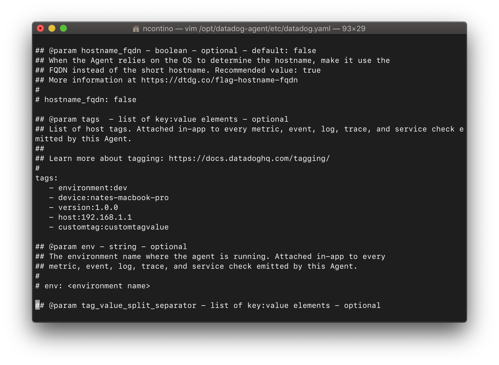
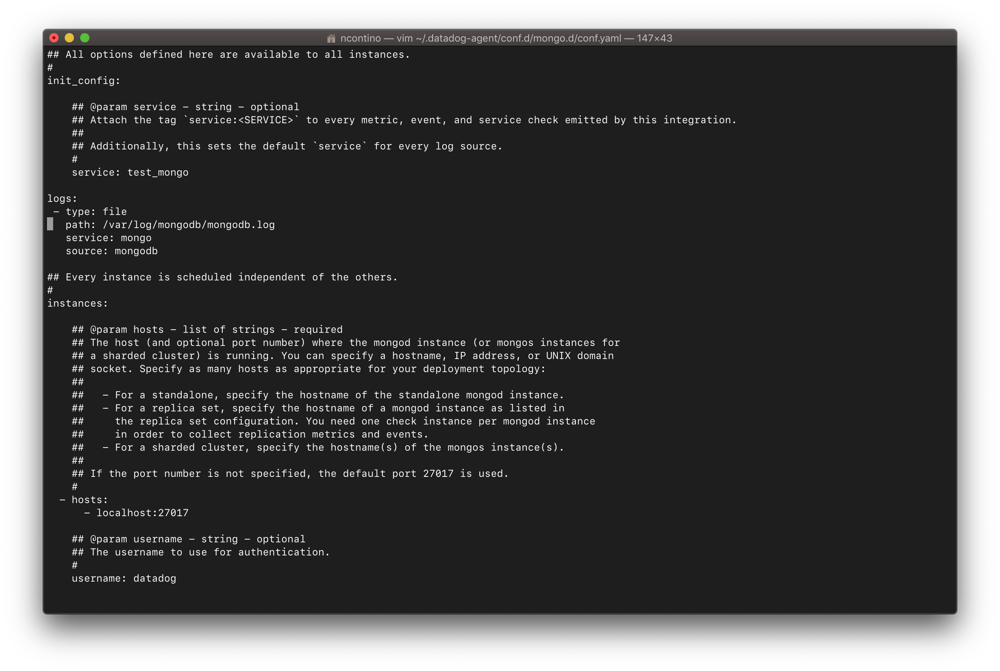
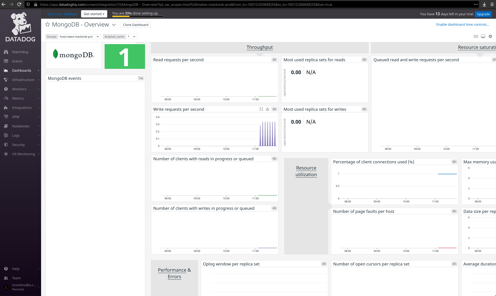
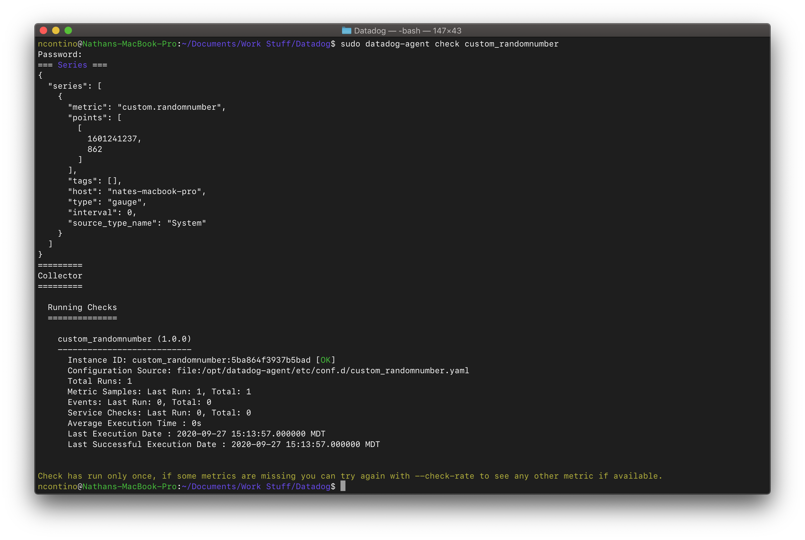
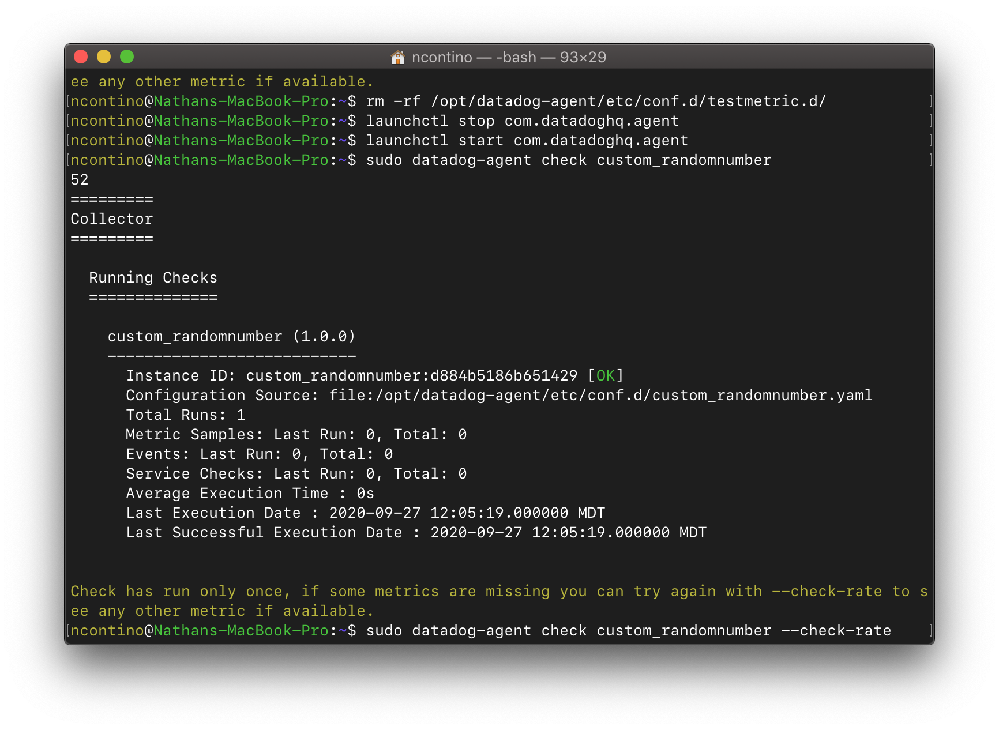
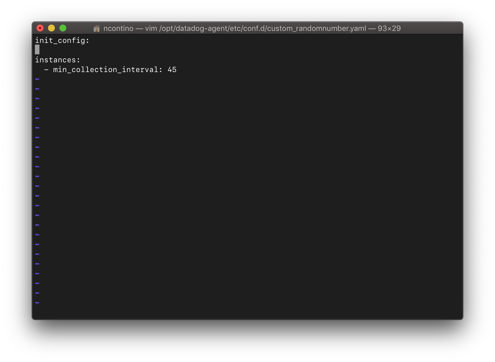
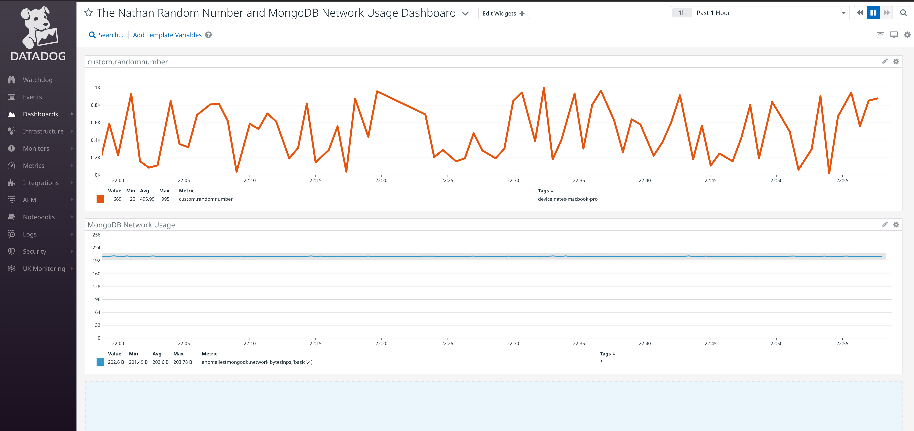
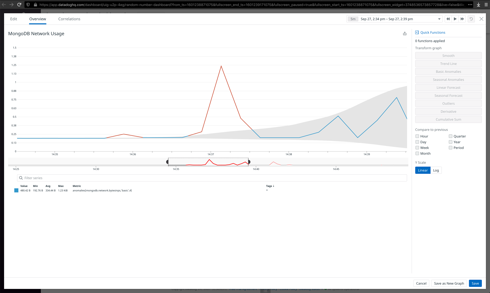

# Overview

Datadog empowers you to monitor machines, containers, and virtual machines through a unified dashboard. All you need is an installation of the Datadog Agent and an API key that corresponds to your login and you can start monitoring.

Before reading this guide, you should first follow the Datadog [guide to installing the Agent](https://docs.datadoghq.com/getting_started/agent/).

# Getting Started with Datadog

In this post, you'll learn how to accomplish a few basic tasks in Datadog, including:

- how to add tags to your datadog hosts
- how to configure Datadog's integration with MongoDB so you can view database-internal statistics
- how to create a custom Datadog Agent check
- how to use the Datadog API to visualize your metrics on a dashboard
- how to use the Datadog API to visualize anomolies in your metrics
- how to install, configure, and use [Brightcove](https://www.brightcove.com/)'s [dog-watcher](https://github.com/brightcove/dog-watcher)

Along the way, we'll also explore some pitfalls I fell into as I figured these tasks out, so you can avoid them in your own Datadog experience.

## Add Tags to Your Datadog Hosts

Every query in Datadog refers to a scope of machines. You can specify the scope in the Metrics Explorer using the "Over:" field and in the Dashboard Graph Editor using the "from" field. By default, you can scope your queries across one or more "devices", with each "device" label referring to a separate Agent installation on a machine. However, if you want to query across some specific subset of machines -- say, all of the machines in your production cluster, or all of the machines that have python 2 installed -- you have to manually add each of those machines individually to the query.

Tags let you group machines together into logical subsets. Once you've established these logical subsets, you can write queries that refer to these subsets. This makes querying easier in a few different ways:

 - Queries become faster to write, because you can refer to a tag once, instead of writing the names of several machines.
 - Queries become less prone to error, since you don't have to worry about getting a machine's name wrong.
 - You don't have to actively add new machines to an old query on an established dashboard; instead, you can just add the new machine to the tag referred to by the old query.

Datadog provides a few different ways to add tags to your devices. You can:

- add tags to the Agent configuration file
- modify the Agent's configuration using the Agent's [web GUI](https://docs.datadoghq.com/agent/guide/datadog-agent-manager-windows/), accessible in the default Agent configuration for Windows and macOS at [http://127.0.0.1:5002/](http://127.0.0.1:5002/)
- add tags using the Datadog UI at [app.datadoghq.com](app.datadoghq.com)

In this example, you'll learn how to add tags using the first option: manually modifying the Agent configuration file on your machine. Check the [documentation for the Agent main configuration file](https://docs.datadoghq.com/agent/guide/agent-configuration-files/?tab=agentv6v7) for the location of this file on your platform. On the macOS machine in this example, the file (or, more correctly, a symlink to the file) is located at ``~/.datadog-agent/datadog.yaml``. The contents of your Agent configuration file should look similar to this:



To add the tags to this file:

1. Open the Agent configuration file in your text editor of choice.
2. Find the commented-out "tags" key. It should look like this:
   ```yaml

      # tags:
      #   - environment:dev
      #   - <TAG_KEY>:<TAG_VALUE>

   ```
3. Remove the comment characters from the line beginnings and add your tags of
   choice. For instance, you could add tags like this:
   ```yaml
      tags:
         - environment:dev
         - device:nates-macbook-pro
         - version:1.0.0
         - host:192.168.1.1
         - customtag:customtagvalue
         - anothercustomtag:anothercustomtagvalue

   ```
   Since [YAML](https://yaml.org/) uses whitespace to determine dictionary hierarchies, make sure that your newly-added tags use the same type of whitespace as the rest of the configuration file. The `tags` key should occur at the very beginning of a line, and there should be exactly three spaces (not a tab) before the hyphen of each item in the `tags` dictionary.

Once you've made these changes to your Agent configuration file, you'll have to restart the Agent for your new tags to go into effect. To learn how to restart the Agent on your machine, check the [documentation for restarting the Datadog Agent](https://docs.datadoghq.com/agent/guide/agent-commands/?tab=agentv6v7#restart-the-agent) for your platform. On the macOS machine used for this example, the following commands stop and start the Agent:
```bash
   $ launchctl stop com.datadoghq.agent
   $ launchctl start com.datadoghq.agent

```

After you've restarted the agent, you should be able to use your new tags in the Metrics Explorer and Dashboard Graph Editor views within a few minutes. Note that [reserved tag keys](https://docs.datadoghq.com/getting_started/tagging/#introduction) such as `host` can take up to two hours to fully refresh in the Datadog UI.

## Configure the Datadog Integration for MongoDB

While Datadog is pretty good at tracking machine-level metrics, the Agent couldn't stay lightweight if it knew how to track the internal metrics for every single application that runs on your machines. Instead, Datadog uses an extension system called **Integrations** that allows third parties like you to provide detailed metrics about software to Datadog. Datadog provides one of these integrations [to monitor MongoDB](https://github.com/DataDog/integrations-core/tree/master/mongo).

The Datadog Agent includes the MongoDB integration by default, so all you have to do is modify a few configuration files to get the integration up and running. Follow the following steps to get the integration working on your machine:

1. [Install MongoDB](https://docs.mongodb.com/manual/installation/) and get a database running locally.
2. Connect to MongoDB with the `mongo` command from your terminal.
3. Create an admin for your MongoDB cluster:
   ```
   	  use admin
	    db.createUser(
         {
            user: "myUserAdmin",
            pwd: passwordPrompt(), // or cleartext password
            roles: [ { role: "userAdminAnyDatabase", db: "admin" }, "readWriteAnyDatabase" ]
         }
      )

   ```
4. Connect to your MongoDB installation with the admin account you just created:
   ```
      use admin
      db.auth("admin", "<YOUR_MONGODB_ADMIN_PASSWORD>")

   ```
5. The MongoDB Integration requires a user account with specific permissions 
   to connect to MongoDB. Create an account with the required permissions with the following command in mongodb:
   ```
      db.createUser({
  	     "user": "datadog",
         "pwd": "<UNIQUEPASSWORD>",
         "roles": [
            { role: "read", db: "admin" },
            { role: "clusterMonitor", db: "admin" },
            { role: "read", db: "local" }
         ]
      })

   ```
6. Open the MongoDB Integration configuration file in your text editor of choice. You can find this file at `mongo.d/conf.yaml.example` in the [Agent configuration directory](https://docs.datadoghq.com/agent/guide/agent-configuration-files/?tab=agentv6v7#agent-configuration-directory) for your platform. On the macOS machine in this example, the file is located at ``~/.datadog-agent/conf.d/mongo.d/conf.yaml.example``. The contents of your Agent configuration file should look similar to this:
   
7. Rename or save ``conf.yaml.example`` as ``conf.yaml``.
8. Configure the ``username``, ``password``, ``hosts``, and ``database`` keys so that the
   Agent can connect to your newly-created local MongoDB instance. You should assign these
   keys the following values:
   ```yaml
   	  - hosts:
          - localhost:27017

        username: datadog

        password: <UNIQUEPASSWORD>

        database: admin

   ```

Once you've made these changes to your MongoDB Integration configuration file, you'll have to restart the Agent for the new integration to run. To learn how to restart the Agent on your machine, check the [documentation for restarting the Datadog Agent](https://docs.datadoghq.com/agent/guide/agent-commands/?tab=agentv6v7#restart-the-agent) for your platform. On the macOS machine used for this example, the following commands stop and start the Agent:
```bash
   $ launchctl stop com.datadoghq.agent
   $ launchctl start com.datadoghq.agent

```

Once you've restarted the agent, you should check to see if the MongoDB Integration connected succesfully to your local cluster. You can do this by running the following command:
```bash
   datadog-agent status

```
In your output, you should see something like the following:

```
   =========
   Collector
   =========

     Running Checks
     ==============

     ...

       mongo (1.16.3)
       --------------
         Instance ID: mongo:f30b5... [OK]
         Configuration Source: file:/opt/datadog-agent/etc/conf.d/mongo.d/conf.yaml
         Total Runs: 1
         Metric Samples: Last Run: 131, Total: 131
         Events: Last Run: 0, Total: 0
         Service Checks: Last Run: 1, Total: 1
         Average Execution Time : 78ms
         Last Execution Date : 2020-09-27 22:23:28.000000 MDT
         Last Successful Execution Date : 2020-09-27 22:23:28.000000 MDT

```
If you see ``[OK]`` after the Instance ID, your integration should be running successfully. If you see an error output, there could be something wrong with your configuration. Double-check your credentials and try restarting the agent.

After you've confirmed that your integration is running successfully, you should be able to use the metrics provided by the MongoDB Integration in the Metrics Explorer and Dashboard Graph Editor views within a few minutes. If you visit your Dashboard List, you should see a few premade MongoDB dashboards such as "MongoDB - Overview" to help you get an idea of the different metrics available:



## Create a Custom Datadog Agent Check

While the built-in metrics and integrations capture a lot of detail about your machines, sometimes you need more detail. You can use [Checks](https://docs.datadoghq.com/developers/write_agent_check/?tab=agentv6v7) to capture custom metrics with your Datadog Agent. Follow the instructions below to implement a custom check that reports a random number between 1 and 1000:

1. In your text editor of choice, create a new Agent Check configuration file 
   named `custom_randomnumber.yaml` in the [Agent configuration directory](https://docs.datadoghq.com/agent/guide/agent-configuration-files/?tab=agentv6v7#agent-configuration-directory) for your platform. On the macOS machine in this example, the file is located at ``~/.datadog-agent/conf.d/custom_randomnumber.yaml``. Place the following YAML into the file:
   ```yaml
      init_config:

      instances:
        - min_collection_interval: 45

   ```
2. In your text editor of choice, create a new Agent Check implementation file 
   named `custom_randomnumber.py` in the ``checks.d`` directory stored at the same level as ``conf.d`` and ``datadog.yaml``. On the macOS machine used for this example, the implementation file is located at ``~/.datadog-agent/checks.d/custom_randomnumber.py``. Place the following Python code into the file:
   ```python
   	  import random
	    # the following try/except block will make the custom check compatible with any Agent version
	    try:
	        # first, try to import the base class from new versions of the Agent...
	        from datadog_checks.base import AgentCheck
	    except ImportError:
	        # ...if the above failed, the check is running in Agent version < 6.6.0
	        from checks import AgentCheck

	    # content of the special variable __version__ will be shown in the Agent status page
	    __version__ = "1.0.0"

	    class RandomNumberCheck(AgentCheck):
	        def check(self, instance):
	            self.gauge('custom.randomnumber', random.randint(0,1000))

   ```

Once you've created the configuration and the implementation for your custom check, you'll have to restart the Agent for the  new check to run. To learn how to restart the Agent on your machine, check the [documentation for restarting the Datadog Agent](https://docs.datadoghq.com/agent/guide/agent-commands/?tab=agentv6v7#restart-the-agent) for your platform. On the macOS machine used for this example, the following commands stop and start the Agent:
```bash
   $ launchctl stop com.datadoghq.agent
   $ launchctl start com.datadoghq.agent

```

Once you've restarted the agent, you should check to see if the check ran correctly. You can do this by running the following command:
```bash
   sudo datadog-agent check custom_randomnumber

```

In your output, you should see something like the following:

If you see an output that includes a heading called "Series", your check is communicating with the Agent correctly.

If you see something like the following instead:

... then your check is not running correctly! In this particular example, the author made the mistake of printing out the metric instead of actually passing it through to the Agent. Don't be like the author -- look for the "Series" heading to verify your check's correctness!

### How to Configure the Collection Interval of Your Check

You can customize the collection interval of your check without modifying the check itself by changing the ``instances.min_collection_interval`` property in the YAML configuration file of your check.



## Visualize Your Check Using the Datadog API

Now that you've created a custom check for your Agent and added the MongoDB Integration, it's time to make a dashboard to visualize your metrics! Run the included ``makedashboard.py`` Python script to create a dashboard that displays your custom metric over time and the network usage of your local MongoDB instance with the anomoly function applied. The following screenshot displays the behavior of the dashboard in the example macOS environment:



## Visualize MongoDB Query Anomolies with the Datadog API

The Anomoly graph displays a grey band around the actual reported values of a metric that indicates what range of values Datadog expects that metric to report based on past behavior. If the actual metrics stray outside of this value, the values turn red and, depending on your configuration, Datadog can alert you about the anomalous values.



You can explore the example dashboard [here](https://p.datadoghq.com/sb/95u7bvn8yqbp1b20-09554cc45afbe9c89b43fc4848180af3).

# Use dog-watcher to Backup Datadog Dashboards

[dog-watcher](https://github.com/brightcove/dog-watcher) is a utility library that helps you track changes to your Datadog dashboards. Every time ``dog-watcher`` runs, it downloads a copy of all of your Datadog dashboards and monitors as JSON. ``dog-watcher`` diffs this JSON against the dashboards and monitors from the last time it ran, and if the monitors and dashboards have changed at all, it uploads the latest copy to GitHub via a new commit in a git repo. This way, you never have to worry about editing your Datadog dashboards -- they're all backed up! Customize away to your heart's content, and if you accidentally ruin everything trying to make your dashboard better than ever, you can always use the Datadog API to restore your dashboard to its former glory.

## Installation

To start using ``dog-watcher``, clone down the ``dog-watcher`` repository with the following command:

```bash
   $ git clone https://github.com/brightcove/dog-watcher.git

```

Once you've downloaded the project, navigate to the root directory of the ``dog-watcher`` git repository:

```bash
   $ cd dog-watcher

```

Next, you'll need to install the dependencies for the project using [npm](https://docs.npmjs.com/about-npm/):

```bash
   $ npm install

```


NOTE: If you haven't already installed npm, you'll need it to run ``dog-watcher``! You can learn how to install npm [here](https://docs.npmjs.com/downloading-and-installing-node-js-and-npm).

And that's it! As long as the ``npm install`` command didn't display any errors (warnings are OK), you're ready to run ``dog-watcher``! Head over to the **Configuration** section to personalize your ``dog-watcher`` installation. If you *did* see errors, you might want to consult [Stack Overflow](https://stackoverflow.com/) -- I'm not sure I'm capable of listing all the possible errors you might run into with npm!

## Configuration

``dog-watcher`` uses SSH Keys to upload and download data from GitHub without manually entering a username and password. To use ``dog-watcher``, you'll need an SSH Key for your GitHub account configured on the machine where you're running ``dog-watcher``. To learn how to set up a GitHub SSH Key on your machine, see [the GitHub documentation on SSH Keys](https://help.github.com/articles/generating-ssh-keys/).

All of ``dog-watcher``'s configuration lives in one file: ``config.json``. ``dog-watcher`` expects you to place this file in the root directory of your installation, right next to ``index.js``. To get started with your configuration, copy the contents of the ``config.json.example`` file provided by ``dog-watcher`` into a new file called ``config.json``. You'll have to fill in values for a few of these JSON fields:

1. Find your API and App keys in the Datadog UI. Navigate to the "Integrations" sidebar entry and click the "APIs" option in the context menu. On the APIs page, you can expand the "API Keys" and "Application Keys" sections to access your keys. Hover over the purple block to view the key itself. For security reasons, you may want to create a new Application Key specifically for ``dog-watcher``.
2. Fill in the values of your Datadog API Key and Datadog App Key in ``config.json`` so that ``dog-watcher`` can communicate with your backend instance of Datadog using the Datadog API. You can do this by copying the values from the "APIs" Datadog UI page into the corresponding "dataDogApiKey" and "dataDogAppKey" fields.
3. Create a new GitHub repo to store your dashboard history.
4. Copy the SSH URL for your GitHub repo (it should look something like ``git@github.com:<your_username>/<your_repository_name>.git``) into the "gitRepoForBackups" field of ``config.json``.
5. If you would like ``dog-watcher`` to generate a Datadog Event whenever the service runs, even if there have been no changes to your dashboards, change the value for the "sendEventOnNoop" field to "true" (note that ``dog-watcher`` expects a string containing the either the word "true" or the word "false", not a JSON boolean).
6. If you decided to set "sendEventOnNoop" to true, you can configure a custom message for your Datadog Event in the "noopEventMessage" field. You'll see this message in the description for an event belonging to "DataDog Dashboard Backup" whenever ``dog-watcher`` runs but doesn't detect dashboard changes, so I suggest something sassy: "No changes to your Datadog dashboards -- are you sure you're working hard enough?".
7. Lastly, configure a [cron](https://en.wikipedia.org/wiki/Cron) backup schedule so that ``dog-watcher`` will regularly run at some interval, backing up your dashboards whenever they change. If you'd rather run ``dog-watcher`` exclusively manually, you can simply delete this field -- but if you do, make sure that you delete the comma after the value for the preceding "noopEventMessage" field: the JSON parser used by ``dog-watcher`` does not like trailing commas in JSON!

## Usage

To run ``dog-watcher``, run the following command in the root directory of the ``dog-watcher`` git repository:

```bash
   $ node index.js

```

You should see output like the following (though the "Scheduling backups" line won't show up unless you configured a cron backup schedule):

```
[2020-09-27T23:47:50.414] [INFO] dog-watcher - Scheduling backups to for */5 * * * *
[2020-09-27T23:50:00.416] [INFO] dog-watcher - Performing a backup

```

Check your GitHub repo to see your uploaded dashboards! Mine is stored at [nathan-contino/monitor_backup](https://github.com/nathan-contino/monitor_backup).

If you see output like the following:

```
[2020-09-27T23:52:53.381] [INFO] dog-watcher - Running a one-time backup.
[2020-09-27T23:52:53.383] [INFO] dog-watcher - Performing a backup
[2020-09-27T23:52:55.132] [INFO] dog-watcher - There was nothing new to commit.

```

...then ``dog-watcher`` didn't detect any new dashboard changes to backup. Make some edits to a dashboard and run ``dog-watcher`` again to see your backups in action! And don't worry if your change isn't great -- your dashboards are backed up now! You can always restore them using the [Datadog API](https://docs.datadoghq.com/api/v1/dashboards/#update-a-dashboard).

## Best Practices

Your dashboards probably don't change too much, so don't configure a cron tab that's too frequent! ``dog-watcher`` uses the GitHub API and the Datadog API to download and upload all of your dashboards, so if you have a lot, that could result in a lot of network traffic. Once a day (``0 0 * * * ``, if you're not a cron expert) should cover most use cases!

## Thanks

Special thanks to [tomruggs](https://github.com/tomruggs) and [huydinhle](https://github.com/huydinhle) at [brightcove](https://github.com/brightcove) for incepting, maintaining, and beta-testing dog-watcher for the rest of us! The Datadog community can always use more folks like you.
